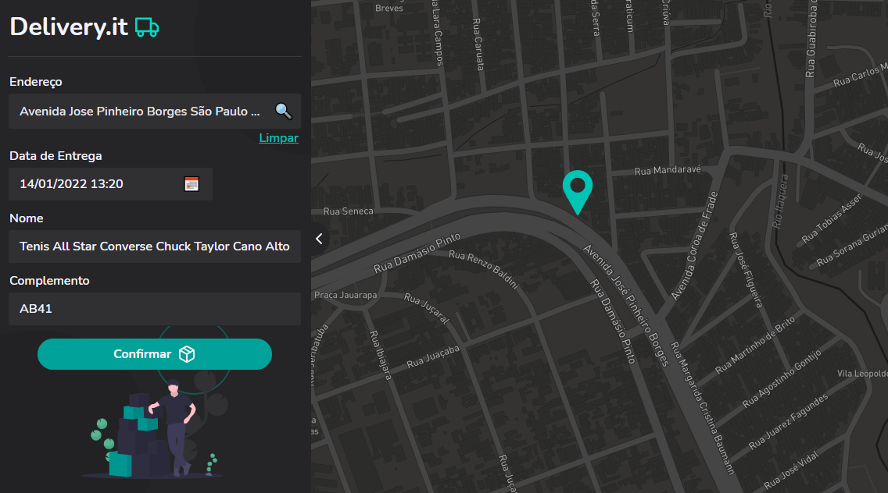
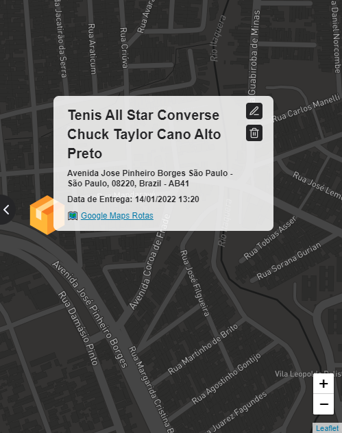

# 🚚 Delivery.it

<p align="center">
    <a href="#-projeto">Projeto</a>&nbsp;&nbsp;|&nbsp;&nbsp;
    <a href="#-tecnologias">Tecnologias</a>&nbsp;&nbsp;|&nbsp;&nbsp;
    <a href="#-instalação">Instalação</a>&nbsp;&nbsp;|&nbsp;&nbsp;
    <a href="#-features">Features</a>&nbsp;&nbsp;|&nbsp;&nbsp;
    <a href="#-licença">Licença</a>
</p>

<p align="center">
    
</p>

<p align="center">
    <kbd>
        
    </kbd>
    &nbsp;&nbsp;&nbsp;&nbsp;
    <kbd>
        
    </kbd>
</p>


## 💻 Projeto

O Delivery.it é uma pequena aplicação para a gestão de entregas de encomendas e produtos, a partir da inserção do endereço e da data da entrega, [Acesse o app clicando aqui](https://delivery-it.herokuapp.com/)

## 🛠 Tecnologias

Esse projeto foi desenvolvido com as seguintes tecnologias:

- [ReactJS](https://reactjs.org)
- [TypeScript](https://www.typescriptlang.org/)

Bibliotecas

- [React Leaflet](https://react-leaflet.js.org//)
- [React Select](https://react-select.com/home)
- [React Datetime](https://github.com/arqex/react-datetime)
- [Axios](https://github.com/axios/axios)

Utilitários

- [Google Fonts](https://fonts.google.com/)

## 🚀 Instalação

```bash

    # Clonar o repositório
    $ git clone https://github.com/Brendon3578/Delivery-It

    # Entrar no diretório
    $ cd Letmeask

    # Instalar as dependências
    $ yarn install

    # Iniciar o projeto
    $ yarn start

```

Lembrando que será necessário criar uma conta gratuita no [Mapbox 🗺️](https://www.mapbox.com/) para criar o **token de acesso**, necessário para se ter acesso à API de Geolocalização.

Depois de ter uma conta do Mapbox, cole a seguinte variável ambiente em um arquivo `.env` criado na pasta **root** do projeto, e insira o token de acesso nesse arquivo:

```bash
REACT_APP_ACCESS_TOKEN_MAP_BOX='insira_o_access_token_do_mapbox_aqui'
```

## ☕ Features

- :earth_americas: Seleção assíncrona de Endereços com a utilização do React-Select
- :calendar: Manipulação de Datas no react atráves do React-Datetime
- :world_map: React Leaflet para o inserimento de mapa no React

## 📝 Licença

Esse projeto está sob a licença MIT. Veja o arquivo [LICENSE](.github/LICENSE.md) para mais detalhes.

---

<h3 align="center">
    Feito com ☕ por <a href="https://github.com/Brendon3578"> Brendon Gomes</a>
</h3>
